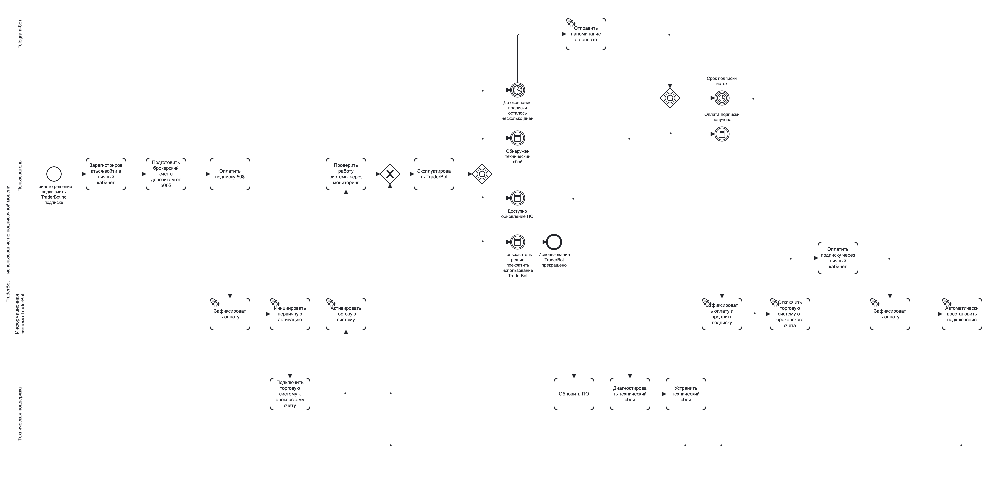

# TO-BE Process: использование TraderBot по подписочной модели

## 1. Цель процесса

Описать процесс подключения, эксплуатации и продления TraderBot в подписочной модели, в которой основная техническая инфраструктура, обновление программного обеспечения и устранение технических сбоев находятся на стороне команды TraderBot.

---

## 2. Границы процесса

**Начало процесса:** пользователь принимает решение подключить TraderBot по подписке.

**Завершение процесса:** пользователь прекращает использование TraderBot.

В рамках процесса также рассматриваются циклические сценарии:

- продление подписки;
- просрочка оплаты и отключение системы;
- автоматическое восстановление после повторной оплаты;
- устранение технического сбоя;
- обновление программного обеспечения.

---

## 3. Участники процесса

- **Пользователь** — регистрируется, подготавливает брокерский счёт, оплачивает подписку и использует TraderBot.
- **Информационная система TraderBot** — фиксирует оплату, инициирует активацию, управляет статусом подписки, отключением и повторным подключением системы.
- **Техническая поддержка TraderBot** — выполняет первичное подключение системы, диагностирует и устраняет технические сбои, выполняет необходимые обновления.
- **Telegram-бот** — автоматически уведомляет пользователя о приближении окончания оплаченного периода.

---

## 4. Основной сценарий подключения

1. Пользователь принимает решение подключить TraderBot по подписке.
2. Пользователь регистрируется или входит в личный кабинет через e-mail или Telegram.
3. Пользователь подготавливает брокерский счёт с рекомендуемым депозитом от **$500**.
4. Пользователь вручную оплачивает подписку стоимостью **$50 в месяц** через личный кабинет.
5. Информационная система TraderBot фиксирует успешную оплату.
6. Система инициирует первичную активацию.
7. Техническая поддержка подключает торговую систему к брокерскому счёту пользователя.
8. Информационная система активирует торговую систему.
9. Пользователь проверяет работу системы через мониторинг.
10. Пользователь переходит к штатной эксплуатации TraderBot.

Первичная активация выполняется с участием технической поддержки и занимает от **15 минут до 24 часов**, при этом по пользовательскому опыту в большинстве случаев — не более **30 минут**.

---

## 5. Штатная эксплуатация

После активации пользователь эксплуатирует TraderBot через личный кабинет.

В рамках использования системы пользователь может самостоятельно изменять:

- уровень риска;
- режим работы торговой системы, например переключаться между более агрессивным и более консервативным режимом.

Данные действия не вынесены в основную BPMN-диаграмму, поскольку не изменяют основной бизнес-процесс подключения и сопровождения подписки. Они будут детализированы отдельно в пользовательских сценариях / Use Cases.

Серверная инфраструктура, обновление программного обеспечения и устранение технических проблем находятся на стороне TraderBot.

---

## 6. Продление подписки

1. За несколько дней до окончания оплаченного периода Telegram-бот автоматически отправляет пользователю напоминание.
2. Процесс ожидает одно из событий:
   - пользователь оплачивает следующий период;
   - срок действующей подписки истекает.
3. Если оплата поступает до истечения подписки:
   - информационная система фиксирует оплату;
   - срок подписки продлевается;
   - эксплуатация TraderBot продолжается без отключения.

Оплата выполняется пользователем вручную через личный кабинет.

Доступные способы пополнения:

- СБП;
- криптовалюта.

---

## 7. Просрочка оплаты и повторное подключение

Если новый период не оплачен к моменту окончания подписки:

1. Срок подписки истекает.
2. Информационная система сразу отключает торговую систему от брокерского счёта.
3. Пользователь вручную оплачивает подписку через личный кабинет.
4. Информационная система фиксирует оплату.
5. Подключение торговой системы к счёту восстанавливается автоматически.
6. Ранее установленные настройки пользователя сохраняются.
7. Пользователь возвращается к штатной эксплуатации TraderBot.

**Льготный период после окончания подписки отсутствует:** отключение происходит сразу после истечения оплаченного периода.

Поведение уже открытых торговых сделок в момент отключения системы в рамках проекта остаётся **открытым вопросом**.

---

## 8. Технический сбой

При возникновении технического сбоя:

1. Команда технической поддержки TraderBot диагностирует проблему.
2. Техническая поддержка устраняет технический сбой.
3. После устранения проблемы система возвращается к штатной эксплуатации.

В отличие от модели AS-IS, пользователю не требуется самостоятельно:

- подключаться к удалённому серверу;
- диагностировать серверный сбой;
- перезапускать необходимые компоненты;
- выполнять техническое восстановление системы.

Формальный SLA технической поддержки отсутствует.

По пользовательскому опыту серверные сбои обычно устраняются в течение примерно **30 минут**, однако данное значение не является гарантированным обязательством.

---

## 9. Обновление программного обеспечения

При появлении новой версии программного обеспечения:

1. Возникает необходимость обновления TraderBot.
2. Команда TraderBot выполняет необходимые действия по обновлению системы.
3. При необходимости обновляются или переустанавливаются компоненты на серверной инфраструктуре.
4. После завершения обновления система возвращается к штатной эксплуатации.

Пользователь больше не должен самостоятельно подключаться к VPS и вручную обновлять или переустанавливать файлы.

---

## 10. Прекращение использования

Если пользователь принимает решение прекратить использование TraderBot:

1. Возникает событие прекращения использования.
2. Основной процесс эксплуатации завершается.

Бессрочная лицензия при этом остаётся отдельной доступной моделью использования продукта.

Пользователь подписочной модели при необходимости может перейти на бессрочную лицензию.

---

## 11. Связь изменений TO-BE с проблемами AS-IS

| ID | Проблема AS-IS | Изменение в TO-BE | Ожидаемый эффект |
|---|---|---|---|
| P-01 | Высокий порог входа | Подписка $50/мес вместо обязательной покупки лицензии от $550 | Снижение стоимости первого доступа к продукту |
| P-02 | Техническая нагрузка на пользователя | Серверная инфраструктура и её обслуживание переходят на сторону TraderBot | Пользователю не требуется самостоятельно администрировать VPS |
| P-03 | Самостоятельное устранение части сбоев | Диагностика и устранение технических проблем выполняются командой TraderBot | Снижение зависимости от технического опыта пользователя |
| P-04 | Сложное обновления ПО | Обновления и переустановка компонентов выполняются централизованно | Исключается необходимость ручной работы пользователя с файлами и удалённым сервером |
| P-05 | Дополнительное управление инфраструктурой | Серверная инфраструктура включена в подписочную модель | Устраняется отдельный процесс управления VPS |
| P-06 | Ограниченная гибкость продукта | Используется единая система с возможностью изменения риска и режима работы | Пользователь может гибко управлять параметрами без смены торгового бота |

---

## 12. Сравнение AS-IS и TO-BE

| Аспект | AS-IS | TO-BE |
|---|---|---|
| Доступ к продукту | Бессрочная лицензия от $550 | Подписка $50/мес |
| VPS | Пользователь отдельно покупает и продлевает VPS | Инфраструктура находится на стороне TraderBot |
| Технические сбои | Пользователь решает самостоятельно или обращается в поддержку | Диагностику и устранение выполняет TraderBot |
| Обновления | Могут требовать удалённого доступа и ручного вмешательства пользователя | Выполняются централизованно командой TraderBot |
| Гибкость настроек | Несколько отдельных ботов с ограниченными настройками | Единая система с изменяемым риском и режимом работы |
| Просрочка оплаты | Не применимо для бессрочной лицензии | Система автоматически отключается |
| Повторное подключение | Может требовать технических действий | После оплаты выполняется автоматически с сохранением настроек |

---

## 13. Основной эффект TO-BE

Ключевое изменение TO-BE заключается в **перераспределении ответственности между пользователем и TraderBot**.

В модели AS-IS пользователь отвечал не только за эксплуатацию торговой системы, но и за значительную часть технической инфраструктуры:

- VPS;
- удалённый доступ;
- обновления;
- устранение части сбоев.

В подписочной модели техническое сопровождение переносится на сторону TraderBot.

Пользователь сохраняет контроль над значимыми торговыми параметрами, но освобождается от необходимости самостоятельно обслуживать инфраструктуру и программное обеспечение.

Одновременно первоначальная стоимость доступа к продукту снижается с **$550 за бессрочную лицензию** до **$50 за первый месяц подписки**.

---

## 14. BPMN-диаграмма

[Открыть исходный BPMN-файл](../diagrams/to_be.bpmn)

> **Примечание по нотации:** диаграмма используется как аналитическая BPMN 2.0-модель и не предназначена для исполнения в Camunda. Отдельные технические параметры элементов в исходном файле используются только для корректного моделирования в редакторе и не описывают фактическую программную реализацию TraderBot.

## 9. Связь изменений TO-BE с проблемами AS-IS

| ID | Проблема AS-IS | Изменение в TO-BE | Ожидаемый эффект |
|---|---|---|---|
| P-01 | Высокий первоначальный порог входа | Подписка $50/мес вместо обязательной покупки лицензии от $550 | Снижается стоимость первого доступа к продукту |
| P-02 | Высокая техническая нагрузка | Инфраструктура обслуживается TraderBot | Пользователю не требуется администрировать VPS |
| P-03 | Самостоятельное устранение части сбоев | Технические проблемы устраняет команда TraderBot | Снижается зависимость от технических навыков пользователя |
| P-04 | Сложное обновление ПО | Обновления выполняются централизованно | Пользователь не работает с файлами и VPS вручную |
| P-05 | Необходимость покупать и продлевать VPS | Серверная инфраструктура входит в подписочную модель | Устраняется отдельный процесс управления VPS |
| P-06 | Ограниченная гибкость отдельных ботов | Единая система с изменяемым уровнем риска и режимом торговли | Повышается гибкость управления продуктом |

## 10. Основной эффект TO-BE

В целевой модели значительная часть технической ответственности переносится с пользователя на TraderBot.

Пользователь концентрируется на управлении торговой системой и её параметрами, тогда как серверная инфраструктура, обновления и устранение технических сбоев выполняются командой TraderBot.

Одновременно подписочная модель снижает первоначальную стоимость доступа к продукту с $550 за бессрочную лицензию до $50 за первый месяц использования.
